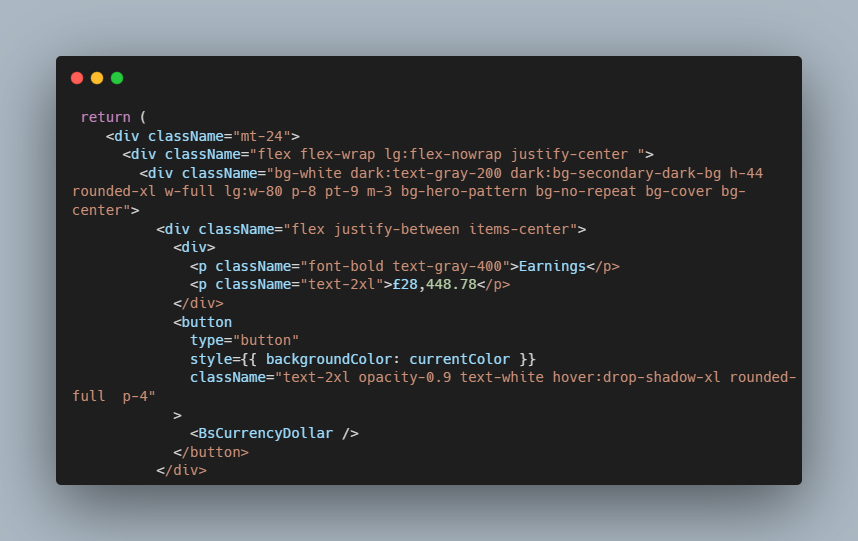

# Plack - Ecommerce Admin Dashboard

### Description

In this project I have created an ecommerce management application, which provides a streamlined way for business users to view, manage, schedule business operations.
Data can also be displayed in several ways with the option for different charts and
financial summary.

### Technology

- Javascript
- React & state management using React Context API
- Reactjs
- Syncfusion UI
- Tailwind CSS

### How to use

### Code Snippet

### Links

For more of my work visit:

---

---

[Personal Profile](https://perrellshaw.netlify.app/)

[What it looks like](images/dashboard.png)

# dash-react-admin
